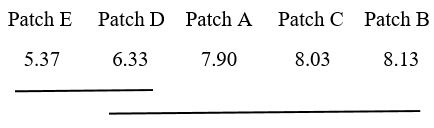

```{r setup, include=FALSE}
knitr::opts_chunk$set(
	echo = TRUE,
	message = FALSE,
	warning = FALSE
)
library(tidyverse)
library(knitr)
library(kableExtra)
library(xtable)
library(car)
```

###Introduction
When there are multiple means to compare it is incorrect to use multiple two independent sample t-tests as this increases the chances of making a Type I error. The One-Way Analysis of Variance (ANOVA), also known as a completely randomized design, is used to determine whether there is a statistically significant difference between the means of two or more independent groups, i.e., the difference in means between groups is too large to be the product of random selection. 

###Data
This post will display the necessary steps in performing the One-Way ANOVA test using data obtained from an experiment conducted by [Bhatnagar and Mehta](https://www.ncbi.nlm.nih.gov/pmc/articles/PMC4925378/) to compare the effectiveness of five different mosquito patches in reducing man mosquito contact.The data contains 30 subjects for each group and for each subject, the number of mosquito bites per hour was recorded. The dependent variable is the number of mosquito bites and the independent variable is the mosquito treatment patch. This experiment can also be described as a single-factor experiment with five levels of the factor, where factor is the mosquito patch and the five levels are the five different patch types. 
```{r}
patch <- read.csv("data/mosquito.csv")
summary_stats <- patch %>% 
                 group_by(Treatment=treatment) %>% 
                 summarise('Sample Size'=n(),Mean=round(mean(number_bites),2),
                           'Standard Deviation'=round(sd(number_bites),2))
kable(summary_stats, align="c","html",caption = "Table 1: Summary Statistics") %>% 
  kable_styling(bootstrap_options="bordered",full_width=F, position="center") 
```


###Model Assumptions

For the ANOVA test to be valid there are three main assumptions about the residuals in the model that must be satisfied:

   + Independence - This assumption is of severe importance as it can render all results invalid if it is violated. This was controlled by the scientists during the planning and execution phases of the experiment.
   
   + Constant Variance - We can determine if constant variance is violated by plotting the residuals vs fitted values and by using a statistical test such as the modified Levene test which is robust to departures from normality. On inspecting Figure 1 we see that there is no obvious pattern (funnel shape) in the plot to indicate that non-constant variance is present. Additionally, for the modified Levene test, the null hypothesis of constant variance was accepted as p-value > 0.05
  
   + Normality - The residuals should follow a normal distribution. However, the analysis of variance is robust to the normality assumption and moderate departures from normality aren't significant. This is especially true for large samples and when the sample size for each group is equal. On inspecting the Q-Q Plot in Figure 1 we observe moderate departure from normality but this is not serious enough to suggest performing a transformation on the data.
   
```{r,fig.align="center", fig.cap="Figure 1: Residual Analysis"}
model <- lm(number_bites~treatment, data=patch)
par(mfrow=c(1,2))
plot(model,which=c(1,2), labels.id = F)
box("outer",lty="solid")
```

Now that we have confirmed that remedial measures are not needed we will create the ANOVA table.

###Ad-Hoc Analysis

The main goal of One-Way ANOVA is to determine whether the means of all groups are equal for the the different levels of one factor. Thus, we wish to test if the mean number of mosquito bites is the same for each of the five patches.
$$H_0: \mu_1= \mu_2=\mu_3=\mu_4=\mu_5$$
$$H_a: \mu_i\neq\mu_j \ for \ some \ unique \ i, j$$
                         
                           
We will conduct this test at a significance level of 0.05. The results of the ANOVA test is shown below.

```{r}
options(knitr.kable.NA='')
kable(anova(model),align="c", digits = 3,"html")%>% 
  kable_styling(bootstrap_options="basic",full_width=F) 

```

There are two ways to determine whether to reject or accept the null hypothesis. The first is to use the F statistic ($F^*$) and compare it to the appropriate percentile of the F-distribution. If $F^*$ > $F_{(1-\alpha, k-1, n-k)}$ where $k$ = 5(number of groups) and $n$ is the sample size, we reject the null hypothesis. We see that $F_{(.95,4,145)}$ = 2.43. Because $F^*$ = 4.48 > 2.43, we reject the null hypothesis.

The second method would be to compare the p-value to the significance level. If the p-value is less than the significance level the null hypothesis is rejected. As p-value = 0.002 < 0.05, we reject the null hypothesis.

Both methods rejected the null hypothesis. Thus, we we can conclude that at a significance level of 0.05, there are differences in the mean number of mosquito bites for the five patches.

###Post-Hoc Analysis
Now that we have determined that there are differences in the mean number of mosquito bites per treatment, the next step is to determine which means differ. This can be achieved by comparing every mean in the dataset with every other mean in the dataset, also known as pairwise multiple comparisons. As there are 5 groups there will be $5(5-1)/2 = 10$ pairwise comparisons.

Now suppose we construct a 95% confidence interval in each case. Then the error rate($\alpha$) is 0.05 for each interval, so there is a 5% chance of making a wrong conclusion in each  of the 10 intervals. Here we are controlling the comparison error rate at 0.05 so that each interval has the same error rate. Thus, as we are performing 10 comparisons the overall experiment error rate, which is the probability of making at least one incorrect conclusion amongst the set of intervals, will be larger than 0.05.

There are various multiple comparison procedures such as Fisher's LSD , Scheffe's method and the Bonferroni method but we shall use the Tukey HSD procedure as it has an experiment error rate of $\alpha$ and a comparison error rate less than $\alpha$. As the experiment error rate is fixed at $\alpha=0.05$ we will be making simultaneous 95% confidence intervals instead of individual 95% confidence intervals. Thus, the probability of making at least one incorrect conclusion amongst the 10 intervals will be 0.05.

```{r, fig.height=6.5, fig.align="center", fig.cap="Figure 3"}
tukey.test <- TukeyHSD(aov(model),conf.level=.95)
plot(tukey.test)
```
Figure 3 shows the confidence intervals for the difference between pairs of means. If the interval contains zero then the difference between any two means is not statistically significant. We see that the confidence intervals for the difference between the means of
Patch E and Patch A, Patch E and Path B and Patch E and Patch C do not contain zero. Thus, these three pairs have means which are significantly different. To determine if there is a significant difference between the means of three of more groups we will list the mean number of bites in ascending order and draw lines beneath means that are not significantly different.

   
   
Based on the above result we see that there is no significant difference in the mean number of mosquito bites between patches E and D. There is also no significant difference between patches A, B, C and D. Thus, we can conclude that patches E and D are the most effective mosquito repellents.


