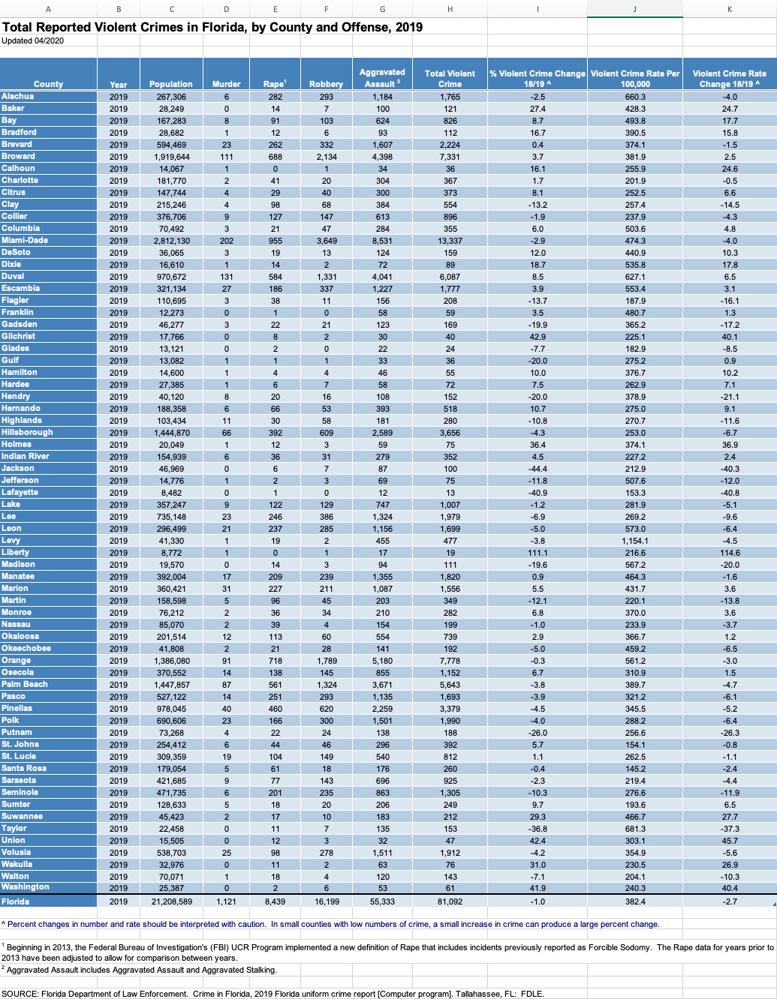

```{r setup, include=FALSE}
knitr::opts_chunk$set(
	echo = TRUE,
	message = FALSE,
	warning = FALSE
)
```

# Exploring Florida's Uniform Crime Report Offense Data

### The Data

This post focuses on exploring the 2019 violent crime report profiles of Florida's counties. The goal is to visualizing the similarities and differences in the overall crime report profiles between counties. 

The following image shows the raw excel file as downloaded from the Florida Department of Law Enforcement [data archive](https://www.fdle.state.fl.us/FSAC/CJAB-Home/Uniform-Crime-Report/Data-Archives/UCR-Offense-Data){target="_blank"}. Before doing any analysis the data needs to be cleaned and formatted. From the raw file we see that the column names are not on the first row and there's a county named Florida which is actually a summary row. Additionally, the last few rows of the excel files represent information that cannot be used in an exploratory analysis. The variables of interests are `county`, `population`, `murder`, `rape`, `robbery`, `aggravated assault`. In addition to formatting the data the rate per 100,000 persons for each offense across all counties will be calculated. This is important as it allows all counties to be compared on an equal scale for each type of offense.



```{r}
library(tidyverse)
library(kableExtra)
library(readxl)
library(janitor)
library(here)
library(ggfortify)

read_violent_crimes <- read_excel(here("data", "violent_crimes.xlsx"))

violent_crimes <- read_violent_crimes %>%
  row_to_names(row_number = 3) %>%
  clean_names() %>%
  mutate_at("county", tolower) %>%
  filter(!is.na(population) & county != "florida") %>%
  select(county,
         population,
         murder,
         rape = rape1,
         robbery,
         aggravated_assault = aggravated_assault_2) %>%
  mutate_at(vars(-county), as.numeric) %>%
  pivot_longer(
    cols = -c(county, population),
    names_to = "attribute",
    values_to = "value"
  ) %>%
  group_by(county) %>%
  mutate(per_hun_thou = round((value / population) * 100000, 2)) %>%
  select(-c(value, population)) %>%
  pivot_wider(names_from = attribute, values_from = per_hun_thou) %>%
  ungroup() 
```

```{r}
kable(head(violent_crimes), caption = "Table 1: Violent Crimes") %>% 
  kable_styling(full_width = FALSE)
```

Let's first run a quick summary to ensure that there isn't any weird data.

```{r}
summary(violent_crimes[-1]) 
```

It appears that there are counties with 0 reports for murder, rape or robbery for 2019. This can be instances where missing data is coded as 0, data entry errors or quite possibly accurate data. We'll use the data as is as we cannot verify exactly what a value of 0 means.

### Principal Component Analysis

Principal component analysis (PCA) will be used to explore this data as it can highlight similarities or differences in the overall crime report profiles between counties. PCA is a dimensionality reduction technique that aims to find a low dimensional representation of the data that captures most of the variability. This [video](https://www.youtube.com/watch?v=FgakZw6K1QQ){target="_blank"} gives a great explanation of PCA.

```{r}
pca <- prcomp(violent_crimes[-1], scale = TRUE, center = TRUE)

summary(pca)
```
There are four principal components as the maximum number of components extracted always equals the number of variables. Suppose that each variable contributed equally to the variance then each variable would contribute 25% of the total variance. PC1 explains 44.4% of the variance in the data and PC2 explains 26.5%. Thus, we'll focus on the first two components as each of these components explain more than any individual variable's variance. Additionally, the first two components account for 71% of the variation in the data. This variation is sufficient to provide a meaningful representation between counties and crime types within the first two components.

```{r, fig.height=4, fig.width = 10}
pca$rotation %>%
  data.frame() %>%
  rownames_to_column("variable") %>%
  pivot_longer(cols = -"variable",
               names_to = "component",
               values_to = "value") %>%
  filter(component %in% c("PC1", "PC2")) %>%
  mutate(terms = tidytext::reorder_within(variable, abs(value), component),
         Direction = if_else(value > 0, "Positive", "Negative")) %>% 
  ggplot(aes(x = abs(value), y = terms, fill = Direction)) +
  geom_col(width = 0.2) +
  facet_wrap( ~ component, scales = "free_y") +
  tidytext::scale_y_reordered() +
  labs(x = "Absolute value of contribution",
       y = NULL,
       caption = "\nFig. 1: PC Loadings") +
  theme_minimal() +
  theme(plot.title = element_text(hjust = 0.5),
        axis.title.y = element_text(size = 15),
        plot.caption = element_text(hjust = 0.5, size = 15))
```

The loadings plot show home much the variables contributed to each PC, i.e. which variables are the most correlated with a given PC. The higher the absolute value of the component loading the more important that variable is to a given component. All of the loadings for PC1 are positive. Thus, PC1 can be thought of as a measure of the overall crime rate with more emphasis placed on robbery and rape while PC2 is mostly about murder and aggravated assault.

A bioplot will be used to visual the data within the plane of the first two components. The geographic region a county belongs to will also be used to highlight if counties that belong to the same region share similar violent crime profiles.
The geographic region data was taken from the Florida Department of Transportation [website](https://www.fdot.gov/agencyresources/districts/index.shtm){target="_blank"}. 

```{r, fig.width=12, fig.height=12}
regions <- read_csv(here("data", "regions.csv"))

violent_crimes <- violent_crimes %>% 
  # fix mispelling so that regions can be joined by county
  mutate(county = if_else(county == "osecola", "osceola", county)) %>% 
  left_join(regions %>% 
              mutate(county = tolower(county),
                     region = str_squish(region)),
            by = "county")

autoplot(
  pca,
  data = violent_crimes,
  loadings = TRUE,
  loadings.colour = 'lightgray',
  loadings.label = TRUE,
  loadings.label.size = 4,
  colour = 'region',
  size = 3.5
) +
  ggrepel::geom_text_repel(max.overlaps = Inf, 
                           label = violent_crimes$county,
                           size = 4.5) +
  geom_vline(xintercept = 0, linetype = 'dotted') +
  geom_hline(yintercept = 0, linetype = 'dotted') +
  scale_color_brewer(palette = "Dark2") +
  labs(caption = "\nFig. 2: PC Biplot") +
  theme_minimal() +
  theme(plot.title = element_text(hjust = 0.5),
        axis.title.x = element_text(size = 15),
        axis.title.y = element_text(size = 15),
        legend.text = element_text(size = 15),
        plot.caption = element_text(hjust = 0.5,  size = 15))
```

The biplot shows how the counties are distributed within the plane of the first two components. It is useful for identifying counties with similar violent crime profiles and for identifying outliers. The further away a vector is from the principal component origin the more it contributes to that principal component. Rape and robbery contributed the most to PC1. Aggravated assault contributed the most to PC2 in the positive direction while murder contributed the most in the negative direction as first shown in Fig. 1.

Counties close to each other have similar violent crime profiles while counties far away from each other have differing violent crime profiles. Counties close to the origin indicate average violent crime profiles. The Northeast counties dominate the upper right quadrant which suggest that these counties have some of the highest aggravated assault and rape reportings per 100k people. It's also interesting to see Escambia and Orange so close together as Escambia is in Northwest Florida while Orange county is in Central Florida. Additionally, Levy, Alachua, Duval and Hendry stand apart from the other counties because of their unusually high report rates, per 100k people, for aggravated assault, rape, robbery and murder respectively. Overall, there isn't much clustering within geographic region for the counties.

It's important to note that the ranking of a county within a single crime type cannot be inferred directly from the plot. For instance, it might appear that Orange county has more reported robberies when compared to Escambia but the raw data shows that Orange county has higher reporting rates for robbery. What can be inferred is that Escambia and Orange are similar to each other in terms of their scores on the first and second principal components which is an aggregate of all the crime types.

