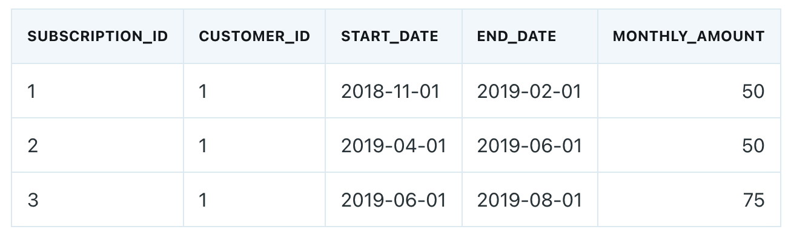
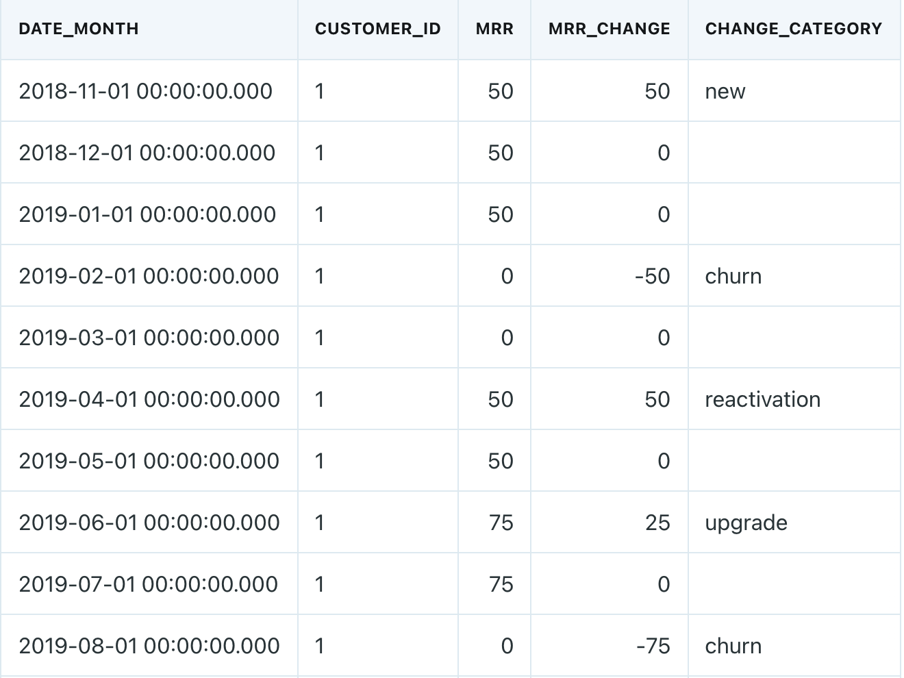

---
output:
  html_document:
    includes:
      in_header: ../navbar.html
    css: ../styles.css
    highlight: pygments
---

```{r setup, include=FALSE}
knitr::opts_chunk$set(
	echo = TRUE,
	message = FALSE,
	warning = FALSE,
	dpi=600
	)
```

# Data Wrangling EP 2: Calculating Monthly Recurring Revenue

I discovered this fantastic [post](https://blog.getdbt.com/modeling-subscription-revenue/){target="_blank"} written by Claire Carroll and I was instantly inspired. I really enjoyed studying her process and figured that it'd be a fun exercise to implement this data transformation in R. I'm not going to convert the SQL code from Claire's post to R code verbatim. Instead, I'll implement my own process for the data transformation. Overall, the input and output data will be the same as in Claire's post. 

Transformations will be executed on this data structure

{width=70%}

to return this output

{width=70%}

The data from Claire's post is located at the [dbt-labs/mrr_playbook](https://github.com/dbt-labs/mrr-playbook){target="_blank"} github repository.

## Load Data
```{r}
library(tidyverse)
library(lubridate)
library(testthat)
library(kableExtra)

subscription_periods <- read_csv("https://raw.githubusercontent.com/dbt-labs/mrr-playbook/master/data/subscription_periods.csv")

kable(subscription_periods) %>% 
  kable_styling(full_width = FALSE) %>% 
  scroll_box(height = '600px')
```

## Data Transformation

#### Rename Variables

-   Rename `start_date`, `end_date` and `monthly_amount` to `subscription_start_date`, `subscription_end_date` and `current_monthly_amount` to explicitly state what these fields represent.

#### Calculate Change Category

The change categories, as defined in Claire's post, are:

-   **new**: the customer is a new customer that has not had a previous subscription

-   **churn**: last month the customer paid for a subscription but this month did not. A customer can churn many times

-   **upgrade**: the customer has increased their usage and is now paying more money per month

-   **downgrade**: the customer has decreased their usage and is now paying less money per month

-   **reactivation**: a previously churned customer has started subscribing again

We can translate these business rules into code by executing the following steps:

-   Create `current_subscription_date` by expanding `subscription_start_date` and `subscription_end_date` ranges to contain one row per month for each 
    `subscription_id`. This is the R equivalent of date spining in SQL.

-   Create `previous_monthly_amount` via `lag(current_monthly_amount`) to determine how much the customer previously paid for their subscription.

-   Create `previous_subscription_date` via `lag(current_subscription_date)`. When `previous_subscription_date` is NA then it's a new customer.

-   Create `next_subscription_date` via `lead(current_subscription_date)`. If the number of months between the `current_subscription_date` and the
    `next_subscription_date` is greater than one month or `next_subscription_date` is NA then the customer churned.

-   If `current_subscription_date == subscription_start_date` and `current_monthly_amount > previous_monthly_amount` then the customer upgraded.

-   If `current_subscription_date == subscription_start_date` and the `current_monthly_amount < previous_monthly_amount` then the customer downgraded.

-   If the number of months between the `previous_subscription_date` and the `current_subscription_date` is greater than one month then the customer reactivated.

```{r}
transformed_subscription_periods <- subscription_periods %>% 
  rename(
    subscription_start_date = start_date,
    subscription_end_date = end_date,
    current_monthly_amount = monthly_amount
  ) %>%
  group_by(subscription_id) %>%
  expand(
    subscription_id,
    customer_id,
    subscription_start_date,
    subscription_end_date,
    current_monthly_amount,
    current_subscription_date = seq(
      subscription_start_date,
      subscription_end_date,
      by = "month"
    )
  ) %>% 
  group_by(customer_id) %>%
  mutate(
    previous_monthly_amount = lag(current_monthly_amount),
    next_subscription_date = lead(current_subscription_date),
    previous_subscription_date = lag(current_subscription_date),
    change_category = case_when(
      is.na(previous_subscription_date) ~ "new",
      interval(current_subscription_date, next_subscription_date) %/% months(1) > 1 |
        is.na(next_subscription_date) ~  "churn",
      interval(previous_subscription_date, current_subscription_date) %/% months(1) > 1 ~ "reactivation",
      current_subscription_date == subscription_start_date &
        current_monthly_amount < previous_monthly_amount ~ "downgrade",
      current_subscription_date == subscription_start_date &
        current_monthly_amount > previous_monthly_amount ~ "upgrade"
    ),
    current_monthly_amount = if_else(change_category == 'churn', 0, current_monthly_amount)
  ) %>%
  # when there are duplicated dates one of the change categories must be NA.
  # arranging allows us to drop the NA change category
  arrange(customer_id, current_subscription_date, change_category) %>%
  distinct(current_subscription_date, .keep_all = TRUE) %>% 
  ungroup() %>% 
  select(
    subscription_id,
    customer_id,
    previous_subscription_date,
    current_subscription_date,
    next_subscription_date,
    previous_monthly_amount,
    current_monthly_amount,
    change_category
  )

kable(transformed_subscription_periods) %>% 
  kable_styling(full_width = FALSE) %>% 
  scroll_box(height = '600px')
```

\

#### Expand Subscription Dates
Create one row per month per customer for an entire customer's life cycle. The goal is to have dates for all months between a customer's initial `subscription_start_date` and final `subscription_end_date`.

```{r}
customer_months <- subscription_periods %>%
  group_by(customer_id) %>%
  expand(
    current_subscription_date = seq(
      min(start_date),
      max(end_date), 
      by = "month"
    )
  )

kable(customer_months) %>% 
  kable_styling(full_width = FALSE) %>% 
  scroll_box(height = '600px')
```

Notice that for `customer_id` 1 a `current_subscription_date` of 2019-03-01 was created. This date was not in `subscription_periods` data set as the customer did not have an active subscription for this month. Thus, there is now one row for each month within an entire customer's life cycle.

\

#### Create MRR Dataset
Left join `transformed_subscription_periods` data set to `customer_months` data set on `customer_id` and `current_subscription_date`. We can then `fill` NAs in `current_monthly_amount` with the last recorded value of that column. This ensures that there's always a recorded revenue for a given month. Finally, calculate `mrr_change` by subtracting the previous monthly amount from the current monthly amount.

```{r message=FALSE, warning=FALSE, include=FALSE}
options(knitr.kable.NA = '')
```

```{r}
monthly_recurring_revenue <- customer_months %>%
  left_join(transformed_subscription_periods, by = c("customer_id", "current_subscription_date")) %>% 
  group_by(customer_id) %>%  
  fill(current_monthly_amount, .direction = "down") %>% 
  mutate(mrr_change = coalesce(current_monthly_amount - lag(current_monthly_amount), current_monthly_amount)) %>% 
  ungroup() %>% 
  select(date_month = current_subscription_date,
         customer_id,
         mrr = current_monthly_amount,
         mrr_change,
         change_category)

kable(monthly_recurring_revenue) %>% 
  kable_styling(full_width = FALSE) %>% 
  scroll_box(height = '600px')
```

\

## Data Tests
Let's run three tests on the `monthly_recurring_revenue` data set to ensure that there are no issues.

1. Test that every `customer_id` in `subscription_periods` data set is in `monthly_recurring_revenue` data set

```{r}
test_that('all customers are accounted for', {
  subscription_periods_customer_id <- subscription_periods %>% 
    distinct(customer_id)
  
  mrr_customer_id <- monthly_recurring_revenue %>% 
    distinct(customer_id)
  
  expect_identical(subscription_periods_customer_id, mrr_customer_id)
})
```

2. Test that the date range for a customer in `subscription_periods` data set is replicated in `monthly_recurring_revenue` data set
```{r}
test_that('all customer subscription dates are accounted for', {
  subscription_periods_date_range <- subscription_periods %>%
    group_by(customer_id) %>%
    summarise(start_date = min(start_date),
              end_date = max(end_date))
  
  mrr_date_range <- monthly_recurring_revenue %>%
    group_by(customer_id) %>%
    summarise(start_date = min(date_month),
              end_date = max(date_month))
  
  expect_identical(subscription_periods_date_range, mrr_date_range)
})
```

3. Test that the combination of `date_month` and `customer_id` is never duplicated
```{r}
test_that('a customer only has one active subscription', {
  number_unique_rows <- monthly_recurring_revenue %>%
    distinct(date_month, customer_id) %>%
    nrow()
  
  total_number_rows <- nrow(monthly_recurring_revenue)
  
  expect_equal(number_unique_rows, total_number_rows)
})
```

\

