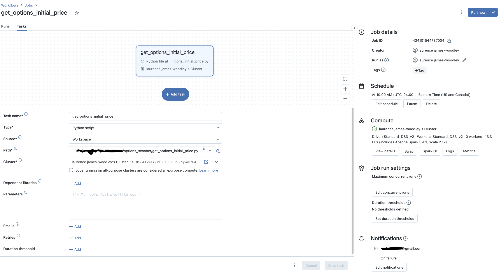
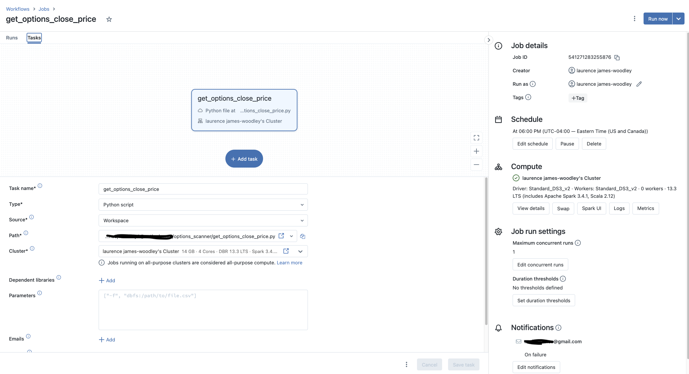

# Building an Options Scanner with Python and Azure Databricks

This project was created  to discover high volume options contracts within the first thirty minutes of market open. It scrapes data from the [Chicago Board Options Exchange](https://www.cboe.com/us/options/market_statistics/symbol_data/?mkt=cone){target="_blank"} (CBOE) to find potential profitable options based on some basic filters. This is a rudimentary scanner that only identifies weekly options.

The criteria for finding contracts is simple. First, the options volume for a given stock must be greater than 1000. Of those high volume options the percentage of calls must be greater than 74% or less than 25%.

Analyzing volume is pivotal as substantial options volume paired with a surge in the underlying stock’s price could signify bullish market sentiment. Conversely, high volume coupled with a falling stock price might indicate a bearish outlook. Moreover, contracts with limited volume often face liquidity issues, hampering the ability to execute trades at favorable prices.

## Python Scripts Overview {.tabset}
The following tabs contain breakdowns of each script’s objective, schedule and output. The output created from this process is stored in Azure Blob Storage with the name `option_contracts_yyyymmdd.csv`. The fields in the csv file are:

+   __option__ - Identifies the contract to purchase.

+   __initial_price__ - The approximate price of the contract at the time `get_options_initial_price.py` was executed.

+   __close_price__ - The approximate price of the contract after market close.

+   __gain_loss__ - Indicates the gain or loss on the contract.


### get_options_initial_price.py

+   __Objective__: Scrapes options data from CBOE and processes it to identify weekly contracts aligning with the defined criteria.

+   __Schedule__: Runs Monday-Thursday at 10:00 EST 

+   __Output__: A csv file with potential options contracts and their price.

``` python
import os
import pandas as pd
import cboe_options_utils
 
url = "https://www.cboe.com/us/options/market_statistics/symbol_data/?mkt=cone"
cboe_options = cboe_options_utils.scrape_options_data(url)

clean_cboe_options = cboe_options_utils.get_clean_cboe_options(cboe_options)

top_tickers_by_volume = cboe_options_utils.get_top_tickers_by_volume(clean_cboe_options)

options_contracts = cboe_options_utils.get_option_contracts(clean_cboe_options, top_tickers_by_volume)

options_scanner_folder_path = '/dbfs/mnt/dls/databricks/options_scanner/'
filepath = f"{options_scanner_folder_path}options_contracts_{pd.Timestamp.today().strftime('%Y%m%d')}.csv"
options_contracts.to_csv(filepath, index=False)
```

### get_options_close_price.py

+   __Objective__: Retrieve the closing prices of the contracts identified in `get_options_initial_price.py`.

+   __Schedule__: Runs Monday-Thursday at 18:00 EST to retrieve end-of-day data.

+   __Output__: The closing prices of the specified contracts and gain/loss calculations.

``` python
import os
import pandas as pd
import cboe_options_utils

url = "https://www.cboe.com/us/options/market_statistics/symbol_data/?mkt=cone"

options_scanner_folder_path = "/dbfs/mnt/dls/databricks/options_scanner/"
filepath = f"{options_scanner_folder_path}options_contracts_{pd.Timestamp.today().strftime('%Y%m%d')}.csv"

if os.path.isfile(filepath):
    option_contracts = pd.read_csv(filepath)

    cboe_options = cboe_options_utils.scrape_options_data(url)

    contract_close_prices = (
        cboe_options.rename(str.lower, axis="columns")
        .rename(columns={"last price": "close_price"})
        .merge(option_contracts, on="option", how="inner")
        .assign(gain_loss=lambda x: round(x["close_price"] - x["initial_price"], 2))
        [["option", "initial_price", "close_price"]]
    )

    # overwrite existing file with close prive
    contract_close_prices.to_csv(filepath, index=False)
```

### cboe_options_utils.py

+   __Objective__: A utility script housing functions for data scraping and processing options data from the CBOE.
``` python
import pandas as pd
import requests

def scrape_options_data(url):
    """
    Scrape options data from Chiccago Board Options Exchange (CBOE).

    Args:
    - url (str): The URL to scrape.

    Returns:
    - DataFrame: Scraped data in a pandas DataFrame.
    """
    response = requests.get(url)
    cboe_data = pd.read_html(response.content, flavor='lxml')[0]
    return cboe_data

def get_clean_cboe_options(cboe_options):
    """
    Process the scraped data to keep only options expiring on the nearest Friday.

    Args:
    - cboe_options (DataFrame): Raw options data from CBOE.

    Returns:
    - DataFrame: Processed options data.
    """
    
    today = pd.Timestamp.today()
    upcoming_friday = today + pd.DateOffset(days=4 - today.dayofweek)
    
    option_splits = cboe_options['Option'].str.split(expand=True)

    clean_cboe_options = (
        cboe_options
        .rename(str.lower, axis='columns')
        .rename(columns={'last price': 'last_price'})
        .assign(
            ticker=option_splits[0],
            exp_month=option_splits[1],
            exp_day=option_splits[2].str.extract('(\d+)').astype(int),
            call_put=option_splits[4].str.lower())
        .query(f"exp_month == '{upcoming_friday.strftime('%b')}' and exp_day == {upcoming_friday.day}")
        [['option', 'ticker', 'exp_month', 'exp_day', 'volume', 'last_price', 'call_put']]
    )
    return clean_cboe_options

def get_top_tickers_by_volume(clean_cboe_options):
    """
    Returns the top 10 tickers by volume.

    Args:
    - clean_cboe_options (DataFrame): Processed options data.

    Returns:
    - DataFrame: Top 10 tickers by volume.
    """
    top_tickers_by_volume = (
        clean_cboe_options
        .groupby(['ticker', 'call_put'])['volume']
        .sum()
        .reset_index()
        .pivot(index='ticker', columns='call_put', values='volume')
        .reset_index()
        .fillna(0)
        .assign(volume=lambda x: x['call'] + x['put'])
        .assign(perc_calls=lambda x: round((x['call'] / x['volume']) * 100, 2))
        .sort_values(by='volume', ascending=False)
        .query("volume > 1000 and perc_calls < 100")
        .head(10)
    )
    return top_tickers_by_volume

def get_option_contracts(clean_cboe_options, top_tickers_by_volume):
    """
    Returns the option contracts with the most potential for profit.

    Args:
    - clean_cboe_options (DataFrame): Processed options data.
    - top_tickers_by_volume (DataFrame): Top tickers by volume data.

    Returns:
    - DataFrame: Option contracts with the highest potential for profit.
    """
   
    top_calls = top_tickers_by_volume.query('perc_calls > 74')['ticker']

    call_contracts = (
        clean_cboe_options
        .query("ticker in @top_calls & call_put == 'call'")
        .groupby('ticker')
        .apply(lambda x: x.nlargest(1, 'volume'))
        .reset_index(drop=True)
        .rename(columns={'last_price': 'initial_price'})
        [['option', 'initial_price']]
    )

    top_puts = top_tickers_by_volume.query('perc_calls < 25')['ticker']

    put_contracts = (
        clean_cboe_options
        .query("ticker in @top_puts & call_put == 'put'")
        .groupby('ticker')
        .apply(lambda x: x.nlargest(1, 'volume'))
        .reset_index(drop=True)
        .rename(columns={'last_price': 'initial_price'})
        [['option', 'initial_price']]
    )

    option_contracts = pd.concat([call_contracts, put_contracts], ignore_index=True)
    return option_contracts
```

## Script Automation {.tabset}
The python scripts are automated via [Azure Databricks jobs](https://learn.microsoft.com/en-us/azure/databricks/workflows/jobs/create-run-jobs){target="_blank"}. The two jobs that run the python scripts are `get_options_initial_price` and `get_options_close_price`.

The following tabs contain the job scheduling details.

### get_options_initial_price




### get_options_close_price

