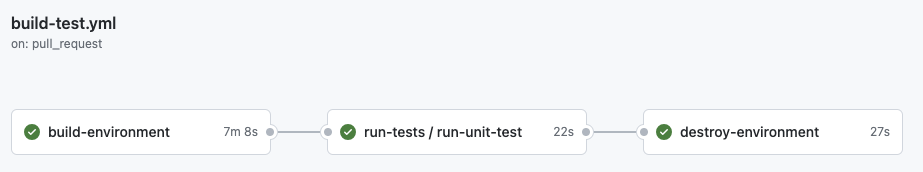
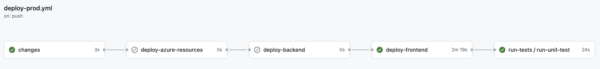

# From Bash Commands to Terraform Plans: A Reproducible Approach To The Cloud Resume Challenge

In the pursuit to expand my skills and knowledge in Azure, I embarked on the [Azure Cloud Resume Challenge](https://cloudresumechallenge.dev/docs/the-challenge/azure/). I first discovered this challenge through Gwyn's [video](https://www.youtube.com/watch?v=ieYrBWmkfno&t=3297s) and I knew right away it'd be a fun project with tremendous learning opportunities. Despite having zero experience with Terraform and having only basic knowledge of GitHub Actions and Azure I was optimistic about using my programming and process automation skills to take an infrastructure as code approach to this challenge.

This led to a clear objective: to engineer a reproducible process that would enable anyone, especially my future self, to easily replicate the main steps of the cloud resume challenge. This goal centered around bash scripts, crafted to mirror the steps from Gwyn's tutorial, minus custom domain configurations. Sounds simple, right? Well, `r emo::ji("joy")`, let's just say the learning curve was greater than I anticipated.

The source code for this project can be found on [GitHub](https://github.com/ljwoodley/azure_cloud_resume_challenge) and the completed resume can be found at https://www.laurencejwoodley.com

### Starting Out

I began the challenge by watching Gwyn's video and following along with her process in the Azure portal. This gave me an understanding of the different sections of the challenge and showed me how everything connected in Azure. It took me about four days to really digest this information and to create my own resume. Concurrently, this stage also involved strategizing and designing the blueprint for the reproducible process.

### Infrastructure as Code with Terraform

I chose Terraform for infrastructure management because of its simplicity, cloud neutrality, and mature ecosystem. Unlike Azure-specific tools like Bicep or ARM, Terraform's clear syntax and extensive documentation made learning and troubleshooting easier.

To ensure a reproducible and consistent setup across and within Azure subscriptions, I focused on:

- Unique Naming: Adding a random string to names of resources such as storage accounts and resource groups at build time to ensure uniqueness.

- Credential Management:  Automated transfer of credentials between resources, like passing the Cosmos DB connection string to the Function App.

- Data Storage: Saving important data like the connection string or app URL to an environment file for use in subsequent steps.

### Scripting The Process

At the core of this project are three Bash scripts, each tailored to automate distinct stages of the project. This aspect, though not a requirement of the challenge, pushed me to dive deeper into understanding the connections between the various pieces. It involved determining the necessary commands and their execution order, a task that truly tested my Azure CLI, Bash and GitHub CLI skills.

Remember I mentioned that I had basic knowledge of GithHub Actions? Previously, I've been manually setting secrets in GitHub. I never knew secrets could be created from an environment file via `gh secret set -f .env` `r paste0(rep(emo::ji("exploding_head"), 3), collapse = "")`! Luckily, this challenge forced me to find a solution for scripting the creation of GitHub secrets as it played a key role in engineering a reproducible process.

Script Summaries:

__build.sh__ - Builds a resource group and all required resources needed for resume creation. This script is used in the development and test stages:

- Initializes Terraform storage and backend.
- Uses Terraform to construct Azure resources.
- Packages and deploys the function app.
- Integrates the function URL into the JavaScript counter file.
- Uploads the frontend assets to the Azure storage account.
- Adjusts Cross-Origin Resource Sharing (CORS) settings.
- Generates an environment file with all essential variables.

__destroy.sh__ - Destroys all resources created by `build.sh` and any associated files, ensuring a clean slate after each build cycle.

__oidc.sh__ - Designed for a one-time configuration run, simplifying the process of managing secrets and credentials across multiple Azure subscriptions and GitHub environments:

- Establishes a Microsoft Entra application and service principal.
- Creates a federated identity credential for this application.
- Configures Azure Client ID, Tenant Id and Subscription ID as secrets within a GitHub environment.

### Automating Deployment and Testing With GitHub Actions

Up to this point, all work was confined to my local machine and my Azure development subscription. Now came the ultimate test: would this process work on a different machine or in a different subscription? Unfortunately, the answer was a resounding no. Beyond minor issues with the bash scripts, I discovered Terraform operated in my development subscription but failed in the production subscription. The CI/CD pipeline didn’t report an error; it simply stalled during the Terraform plan step, leading me to manually abort the job. I suspected a problem with credential configuration in GitHub, but even after verifying and re-running, success eluded me. I was even more baffled when I encountered the same issue during a local test in my production subscription. "Is Terraform limited to one subscription per account?" I asked myself.

Figuring out how to use Terraform across multiple subscriptions within the same account was a journey. I recall dedicating 45 minutes to solving this, only to find myself two hours later, still at my computer, engulfed in frustration. Where did the time go? I seriously began doubting my choice to use OIDC for authentication, as most online resources that solved this issue used service principals. At this point it was 1 am and I knew that persisting would be counterproductive so I decided to call it quits. The next morning I woke up with a solution! What if I passed the subscription ID as a Terraform variable to the provider block? I scurried over to my laptop and began working. In hindsight, I realized that this solution was hinted at in several blog posts but exhaustion had clouded my ability to see it.

Pipeline Summaries:

__build-test.yml__ - Triggered on each pull request to the main branch, this pipeline utilized `build.sh` to build a fresh Azure testing environment and execute the designated tests. Successful test completion was followed by `destroy.sh`, ensuring the test environment was destroyed.

__deploy-prod.yml__ - Triggered upon changes to the terraform, backend or frontend folders on pushes to the main branch. This pipeline was tasked with deploying Azure resources and pushing updates to the backend and frontend. It also conducted tests on the production environment, ensuring that no issues were introduced in the deployment. The pipeline is designed to execute jobs sequentially, stopping if any job fails and skipping jobs if there are no changes in their respective folders. As illustrated below, the second and third jobs were skipped due to no updates in the terraform or backend folders.

__run-tests.yml__ A reusable workflow that tests the API's functionality and whether the visit count is displayed on the webpage. These tests are written in python and  are executed on every pull request or push to main branch.

### Final Thoughts
This challenge was a great introduction to cloud development, IaC and CI/CD. Spanning six weeks, from the initial inspiration drawn from Gwyn's video to writing this post, it's been a rewarding experience. I'm hesitant to say that I've completed the challenge because there's so meany features that I'd like to implement. Instead, consider this to be a minimal viable product.

For future challengers that would like to replicate this process please refer to the GitHub [repo](https://github.com/ljwoodley/azure_cloud_resume_challenge) for instructions.  Specifically, follow through to step 3 of the development environment section. I'm curious to see what bugs will be discovered (and yes, there are a few waiting to be discovered `r emo::ji("smile")`).

